# Forge

Forge is a real-time Binance spot market dashboard with deterministic technical analysis, an optional OpenRouter language-model narrative layer, and a closed-loop calibration system. It is built for traders who want verifiable numbers first and AI synthesis second — not the other way around.

## What Forge computes

Analysis runs server-side in Supabase Edge Functions. The frontend chart mirrors many of the same indicators incrementally for display; the AI snapshot uses the shared context builder.

### Price and session context
- Last price, candle change %, volume, **relative volume** (vs 20-bar average)
- **Session ranges** (Asia / London / New York UTC buckets) on intraday timeframes
- **CME gap** levels (Friday close vs Monday open) for confluence
- Multi-timeframe reads (RSI / MACD histogram tails on higher intervals)

### Core indicators (on every enriched candle)
- **EMA** 20 & 50
- **RSI** 14, **MACD** (12/26/9)
- **ATR** 14 + ATR%
- **Bollinger Bands** (20, 2σ) with %B and bandwidth
- **Session VWAP** (UTC day reset)
- **ADX** / +DI / −DI (14)
- **OBV**, **CVD** (from Binance taker-buy volume)
- **Relative volume**

### Extended volatility and trend overlays (context block + chart)
- **Keltner channels**, **TTM squeeze** state and momentum
- **Supertrend**, **Ichimoku**, **Donchian** channels
- **Stochastic RSI**
- **Realized volatility**, **Hurst exponent**, **Chandelier exit**, persistence metrics (Hurst / persistence are **context-only** today — surfaced in the analysis snapshot but not wired into `deriveRegime` gating until a backtest A/B justifies it)
- **Market regime** (`trending` | `ranging` | `volatile_chop`) from ADX slope, ATR percentile, Bollinger bandwidth percentile

### Market structure and liquidity
- Fractal **swing highs/lows**, HH/HL/LH/LL labels, **break of structure**
- Scored **support/resistance zones**, nearest support/resistance
- **RSI / MACD divergence** (requires two confirmed swings)
- **Equal highs/lows** liquidity pools, **sweeps**, **FVGs**, **order blocks**
- **Confluence map** across pivots, VWAP anchors, VP nodes, pools, gaps

### Volume profile
- **POC**, **VAH/VAL**, **HVN/LVN** nodes
- **Naked POC** tracking, **developing value area** for the active session
- Volume distributed across each candle's range (not dumped at midpoint)

### VWAP
- Session VWAP plus **anchored VWAPs** from significant structure points
- Price relation labels per anchor; bands where applicable

### Order flow and microstructure (when Binance data is available)
- **Order book imbalance** (±1% depth)
- **Book slope** (cost to move mid ~1%)
- **Resting walls** (largest limits in scanned depth)
- Thin-book detection feeds guardrails

### Derivatives context (futures endpoints; optional liquidation heatmap)
- **Funding rate** + **z-score** and crowding label
- **Open interest** Δ4h / Δ24h and slope
- **Taker long/short ratio** and 24h trend
- **Mark basis** vs spot/index
- **Liquidation clusters** — model estimates from Coinglass when `COINGLASS_API_KEY` is set; otherwise null with explicit completeness flags

### Cross-market (alts vs BTC)
- **Correlation** and **beta** on log returns
- BTC regime/trend snapshot
- **Dominance proxy** (BTC/ETH ratio — not true market-cap dominance)

### Pivots
- Classic, Fibonacci, and Traditional (auto higher-timeframe) sets with price-zone classification

### Signal agreement
- Deterministic alignment score across EMA stack, RSI side, MACD, pivot bias, S/R presence, divergence, pivot inflection — **not a probability**

---

## Decision layer (never from the model)

After the trade plan is built (deterministic engine, with optional AI narrative), Forge attaches:

| Output | Meaning |
|--------|---------|
| **Calibrated hit rate** | Empirical win rate for this `setup_type` × `regime` bucket (greyed when n &lt; ~20) |
| **Expected value (EV)** | `p·R − (1−p)·1 − fee_cost_R` in R-multiples |
| **Break-even hit rate** | Win% needed for EV = 0 given reward:R and fees |
| **Verdict** | `TAKE` / `SKIP` / `WAIT` — TAKE only with positive EV and usable calibration |
| **Guardrails** | Hard blocks: negative EV, event blackout, funding window, daily loss limit, max open R, loss cooldown, thin book, correlated alt exposure |
| **Management plan** | Partial targets, stop rules, time-stop hints — computed server-side |

Guardrail overrides are explicit UI actions and logged to `risk_overrides` — no silent auto-approval.

---

## AI analysis pipeline

1. Build **market snapshot** (all features above + pivots + cross-market).
2. **Single** OpenRouter call with strict JSON schema (model id from `OPENROUTER_MODEL`).
3. **Field validation** against deterministic values.
4. **Trade-plan geometry check** (stop side, target order, entry proximity) — bad plans are replaced.
5. **Regime gating** (e.g. `wait` in volatile chop; range fades only near real zones).
6. **Calibration clamp** if model confidence exceeds measured hit rate.

Provenance badge: **Live AI** / **Partial AI** / **Baseline** (rules engine only). Progress steps in the UI are cosmetic — not multiple model passes.

---

## Scanner, watchlist, and alerts

Database schema (migration `20260722070000_decision_proactive_learning.sql`):

- **`watchlist`** — per-user symbol + interval rows with `enabled` flag (scanner input list).
- **`price_alerts`** — armed alerts on levels from plan entry / invalidation (Trade Plan buttons), or manual; `direction` above/below.
- **`check-alerts`** — cron every minute (`X-Cron-Secret`); marks triggered rows and Realtime UPDATE events drive in-app toasts.

Deploy the `check-alerts` cron migration and enable Realtime on `price_alerts` for toast delivery. Browser notifications are still out of scope — in-app status/toast is the v1 path.

---

## Calibration loop and Brier score

1. Each analysis stores a trade plan with `setup_type`, `regime`, and confidence.
2. **`score-predictions`** cron (hourly, requires `CRON_SECRET`) walks forward candles and scores outcomes: `target_hit`, `stop_hit`, `no_fill`, `expired`, with MAE/MFE and realized R.
3. **`fetchEmpiricalCalibration`** buckets live outcomes: `setup_regime` → `setup` → `global` fallback.
4. **`setup_baselines`** holds backtest-seeded priors for cold start (see backtest workflow below).

**Brier score** (Accuracy panel): mean of `(predicted_probability − outcome)²` over decided trades. 0 = perfect; 0.25 ≈ unskilled 50/50 coin flip. Lower is better calibrated. Use it with the **reliability curve** (hit rate by confidence decile) to see where the system is over- or under-confident.

---

## How a trade flows through Forge

```mermaid
flowchart LR
  A[Watchlist / Chart] --> B[get-market-data + indicators]
  B --> C[ai-analysis snapshot]
  C --> D[Model JSON optional]
  D --> E[Validation + geometry + regime gate]
  E --> F[Calibration + EV + guardrails]
  F --> G[Verdict TAKE/SKIP/WAIT]
  G --> H[Journal entry]
  H --> I[score-predictions]
  I --> J[Calibration + Brier update]
```



1. **Scan** — pick symbol/timeframe (watchlist or manual).
2. **Analyze** — edge function builds context; optional AI narrative.
3. **Verdict** — EV, break-even rate, guardrails; override only deliberately.
4. **Journal** — log adherence, behavioral tags, MAE/MFE when scored.
5. **Calibrate** — scored outcomes refine hit rates; Brier tracks probability honesty.

---

## Tech stack

### Frontend
- React 18 (Vite), Lightweight Charts
- Supabase Auth + Edge Function invokes
- Liquid Glass UI, dark/light mode

### Backend
- Supabase Edge Functions (Deno/TypeScript)
- Postgres (preferences, cache, analysis logs, journal, calibration, watchlist, alerts, baselines)
- Binance spot + futures public APIs; OpenRouter; optional Coinglass

---

## Getting started

### Prerequisites
- Node.js 18+ and npm
- [Supabase CLI](https://supabase.com/docs/guides/cli)
- Supabase project (or `supabase start` locally)
- [OpenRouter API key](https://openrouter.ai/) for AI narrative (optional — baseline analysis works without it)

### 1. Supabase setup

```bash
cd supabase
```

Copy `supabase/.env.example` → `supabase/.env`:

```env
SUPABASE_URL=
SUPABASE_SERVICE_ROLE_KEY=
MARKET_CACHE_TTL_SECONDS=300
ALLOWED_ORIGINS=http://localhost:5173,http://127.0.0.1:5173
OPENROUTER_API_KEY=
OPENROUTER_HTTP_REFERER=
OPENROUTER_MODEL=
CRON_SECRET=your-strong-shared-secret
COINGLASS_API_KEY=
```

| Variable | Required | Purpose |
|----------|----------|---------|
| `SUPABASE_URL` | Yes | Project URL |
| `SUPABASE_SERVICE_ROLE_KEY` | Yes | Server-side Postgres / functions |
| `MARKET_CACHE_TTL_SECONDS` | No | Candle cache TTL (default 300) |
| `ALLOWED_ORIGINS` | No | CORS allowlist for edge functions |
| `OPENROUTER_API_KEY` | For AI | Model narrative layer |
| `OPENROUTER_HTTP_REFERER` | Recommended | OpenRouter attribution |
| `OPENROUTER_MODEL` | No | Model id override (default free tier in `.env.example`) |
| `CRON_SECRET` | Yes for scoring | Shared secret for `score-predictions` cron |
| `COINGLASS_API_KEY` | No | Liquidation heatmap estimates; without it, liquidation fields are null |

**Cron secret pairing** (prediction scoring):
1. Edge secret: `supabase secrets set CRON_SECRET=your-strong-shared-secret`
2. Database: `alter database postgres set app.settings.cron_secret = 'your-strong-shared-secret';`

Without pairing, `score-predictions` returns **503** (fail-closed).

**Migrations** — run on fresh setup:

```bash
supabase start
supabase db reset   # applies all migrations under supabase/migrations/
supabase functions serve --env-file .env
```

Notable recent migrations:
- `20260722050000_trade_journal.sql` — journal + scored outcomes
- `20260722060000_regime_calibration_bucket.sql` — setup×regime calibration
- `20260722070000_decision_proactive_learning.sql` — risk settings, watchlist, price_alerts, setup_baselines
- `20260722100000_user_preferences_extended_keys.sql` — chart overlay + pivot pref allowlist
- `20260722110000_check_alerts_cron.sql` — minutely `check-alerts` cron + Realtime on `price_alerts`

Production: set secrets in **Project Settings → Edge Functions → Secrets**, deploy with `supabase functions deploy`.

### 2. Frontend setup

```bash
cd frontend
npm install
```

Copy `frontend/.env.example` → `frontend/.env`:

```env
VITE_SUPABASE_URL=
VITE_SUPABASE_ANON_KEY=
```

```bash
npm run dev
```

App: `http://localhost:5173`

---

## Backtest and baseline seeding

Walk-forward backtest CLI (deterministic plans, no model):

```bash
deno run --allow-net --allow-write scripts/backtest.ts \
  --symbol BTCUSDT --interval 4h --bars 2000 --step 10 --out backtest-results.json
```

Output: per `setup_type|regime` bucket — `n`, `hit_rate`, `avg_r`, `no_fill_rate`, `expiry_rate`.

**Intended `--upload` workflow** (flag not wired yet):

1. Run backtest locally → `backtest-results.json`
2. `deno run scripts/backtest.ts --upload backtest-results.json` (planned) maps summary rows into `public.setup_baselines` (`setup_type`, `regime`, `symbol`, `interval`, `hit_rate`, `n`)
3. Live `score-predictions` outcomes gradually replace or outweigh baselines as `n` grows

Until `--upload` exists, insert baselines manually or via SQL from the JSON summary. Baselines are priors, not proof of live edge.

---

## Regenerate education content

```bash
node scripts/build-education-data.mjs
```

Writes `frontend/src/data/educationData.js` (16 categories, 80 topics).

---

## License

Educational and personal use. Live trading is at your own risk.
